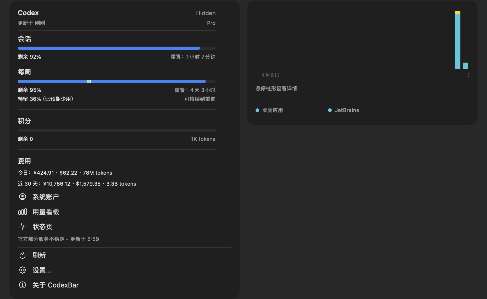
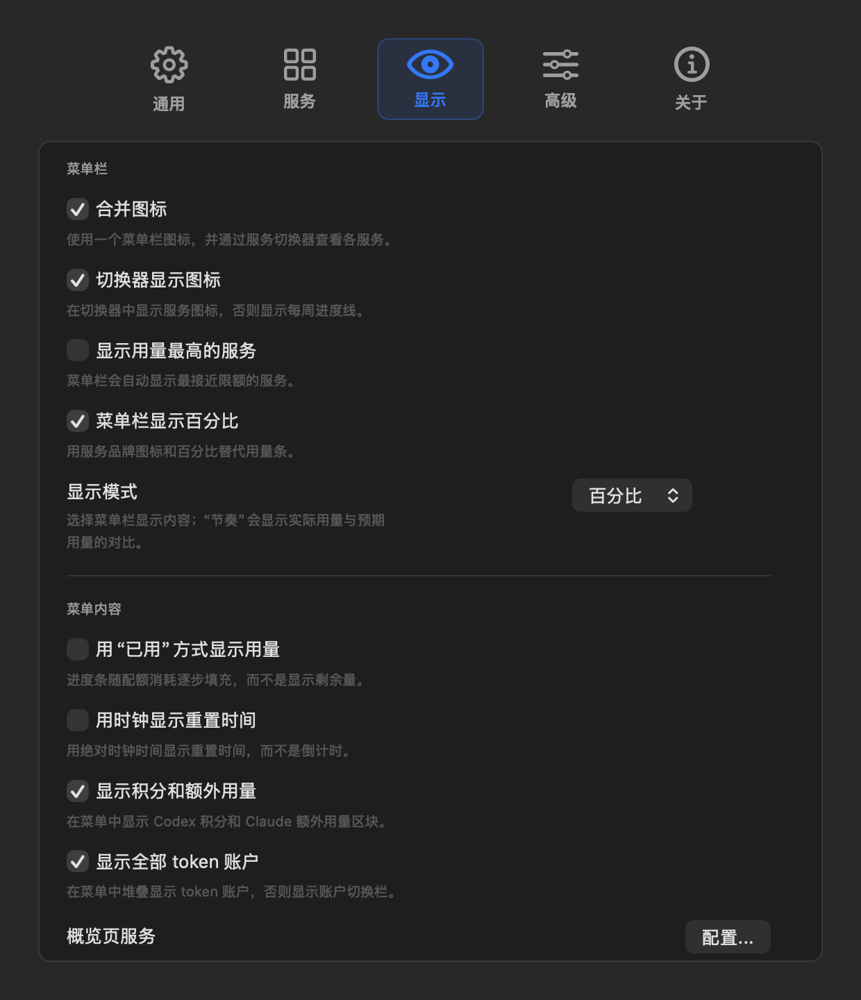
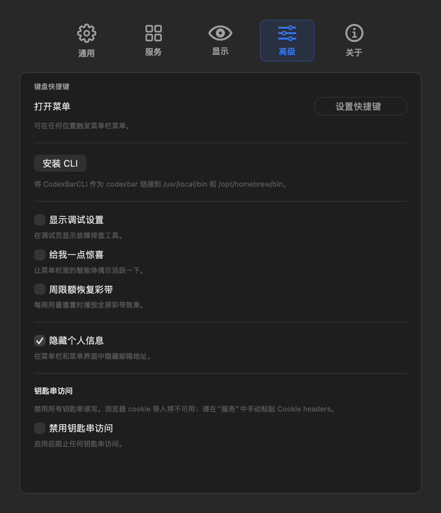
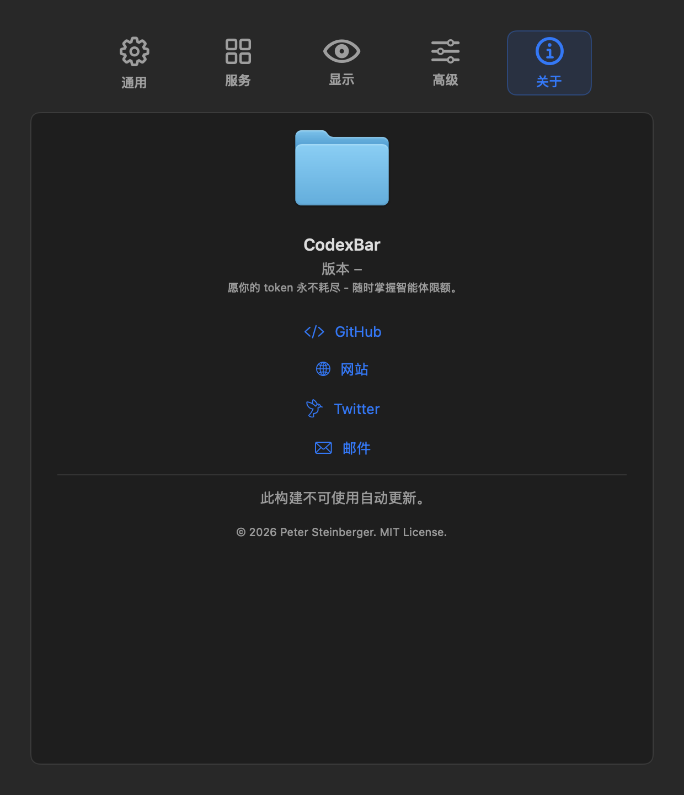

# CodexBar 中文版

<p align="center">
  <a href="https://github.com/steipete/CodexBar">上游项目</a>
  ·
  <a href="#安装">安装</a>
  ·
  <a href="#界面预览">界面预览</a>
  ·
  <a href="#普通用户无需-xcode">无需 Xcode</a>
  ·
  <a href="#更新策略">更新策略</a>
  ·
  <a href="#开发与验证">开发与验证</a>
</p>

<p align="center">
  
  
  
  
</p>

CodexBar 中文版是 [CodexBar](https://github.com/steipete/CodexBar) 的非官方中文本地化构建。它保留原项目的多服务用量监控能力，并把菜单栏、设置页、提示弹窗、调试入口和常见状态文案整理为中文。

本仓库的核心目标不是替换官方版本，而是提供一个可审计、可更新、不会破坏官方更新链的中文版本。

## 界面预览

截图使用脱敏演示数据生成，账号信息不会出现在仓库图片中。

| 主菜单 | 显示设置 |
| --- | --- |
|  |  |

| 高级设置 | 关于 |
| --- | --- |
|  |  |

## 适合谁

- 希望在 macOS 菜单栏直接查看 Codex、Claude、Cursor、Gemini、Copilot 等服务用量的用户。
- 希望 CodexBar 界面中文化，但不想直接修改 `/Applications/CodexBar.app` 的用户。
- 希望保留官方 Homebrew/Sparkle 更新能力，同时单独维护中文构建的用户。

## 主要特性

- 中文化菜单栏入口：设置、刷新、关于、退出、用量看板、状态页等。
- 中文化设置界面：通用、服务、显示、高级、关于、调试页。
- 中文化用量状态：账户、套餐、配额、积分、重置时间、刷新状态、错误摘要。
- 中文化常见弹窗：登录、移除账户、钥匙串提示、Copilot 设备流、Vertex AI 引导。
- 费用人民币估算：在美元费用和 tokens 前增加 `¥` 估算值，方便中文用户快速判断消耗。
- 普通用户免编译安装：直接下载 GitHub Release 里的预构建 `.app`，无需安装 Xcode。
- 独立安装：安装为 `/Applications/CodexBar 中文.app`，不覆盖官方 `/Applications/CodexBar.app`。
- 可回退英文：启动时设置 `CODEXBAR_LANG=en` 可临时使用英文文案。

## 安装

### 普通用户无需 Xcode

推荐使用预构建版本。普通使用者只需要 macOS 14+，不需要安装 Xcode，不需要拉源码，不需要本机编译。

```bash
bash -c "$(curl -fsSL https://raw.githubusercontent.com/zpmdd/CodexBar-zh/main/Scripts/install_latest_zh.sh)"
```

这个脚本会从 [GitHub Releases](https://github.com/zpmdd/CodexBar-zh/releases/latest) 下载最新的中文预构建包，解压后安装到 `/Applications/CodexBar 中文.app`，并启动应用。

也可以手动安装：

1. 打开 [最新 Release](https://github.com/zpmdd/CodexBar-zh/releases/latest)。
2. 下载 `CodexBar-zh-macos-universal.zip`。
3. 解压后把 `CodexBar 中文.app` 拖到 `/Applications`。
4. 首次启动如果 macOS 提示来源限制，在“系统设置 → 隐私与安全性”中允许打开。

说明：当前中文预构建包使用本地 adhoc 签名，不是 Apple Developer ID 公证包。安装脚本会清理下载隔离属性，减少首次打开阻拦；后续如果项目接入正式 Developer ID 签名，可以移除这一步。

### 开发者从源码安装

只有维护者、开发者、需要自行审计源码的人，才需要本机构建。

环境要求：

- macOS 14+
- 完整 Xcode，建议安装到 `/Applications/Xcode.app`
- Git

```bash
git clone https://github.com/zpmdd/CodexBar-zh.git
cd CodexBar-zh
./Scripts/install_zh_app.sh
```

脚本会执行以下动作：

- 使用本机 Xcode 构建 CodexBar
- 以 adhoc 方式签名本地中文构建
- 安装到 `/Applications/CodexBar 中文.app`
- 验证代码签名
- 启动中文版本

生成可发布的中文预构建包：

```bash
./Scripts/package_zh_release.sh
```

产物会放到 `dist/`，默认生成 `CodexBar-zh-macos-universal.zip` 和对应 SHA-256 校验文件，供 GitHub Release 上传使用。

## 更新策略

本项目刻意采用独立 App 策略：

- 官方版本仍位于 `/Applications/CodexBar.app`
- 中文版本位于 `/Applications/CodexBar 中文.app`
- 官方 Homebrew 更新仍然只影响官方 App
- 中文版本不会开启官方 Sparkle 更新源，避免自动更新覆盖汉化改动

如果你通过 Homebrew 安装官方版本，仍可正常更新：

```bash
brew upgrade --cask codexbar
```

更新中文版本：

```bash
bash -c "$(curl -fsSL https://raw.githubusercontent.com/zpmdd/CodexBar-zh/main/Scripts/install_latest_zh.sh)"
```

如果你是从源码安装的开发者版本，也可以继续使用 `git pull --rebase` 后重新运行 `./Scripts/install_zh_app.sh`。

跟进上游改动时，建议保留上游远端：

```bash
git remote -v
git fetch upstream
git rebase upstream/main
./Scripts/install_zh_app.sh
```

## 与官方版本的关系

这是非官方中文本地化版本。

- 上游项目：<https://github.com/steipete/CodexBar>
- 上游作者：Peter Steinberger
- 上游许可证：MIT
- 本仓库保留原版权和许可证声明
- 本仓库的中文本地化改动同样按 MIT 许可证发布

如果你只需要官方英文版，请优先使用官方发布渠道：

```bash
brew install --cask steipete/tap/codexbar
```

## 隐私与权限

CodexBar 的数据来源策略继承自上游项目：默认读取本机已知位置的 CLI 状态、日志、浏览器 cookie 或 Keychain token。相关能力通常是按服务开启，而不是全盘扫描。

常见权限包括：

- Keychain：读取浏览器安全存储、Claude OAuth、Copilot token、z.ai token 等。
- Full Disk Access：仅在读取 Safari 等受保护位置 cookie 时可能需要。
- 文件夹访问：当被调用的 CLI 访问项目目录或外部磁盘时，macOS 可能弹出授权。

除费用区块的人民币估算会按需访问 Frankfurter 免费汇率接口获取 USD/CNY 汇率外，本中文构建不会额外增加联网、遥测或后台采集逻辑。汇率缓存只保存汇率、汇率日期和抓取时间，不包含账号信息；网络失败时会继续使用上次缓存，首次获取失败则回退为美元原格式。

## 开发与验证

汉化入口集中在：

- `Sources/CodexBar/CodexBarLocalization.swift`

安装脚本：

- `Scripts/install_zh_app.sh`
- `Scripts/install_latest_zh.sh`
- `Scripts/package_zh_release.sh`

打包脚本仍沿用上游流程，并增加了本地构建需要的参数：

- `CODEXBAR_APP_NAME`
- `CODEXBAR_BUNDLE_ID`
- `CODEXBAR_FEED_URL`
- `CODEXBAR_AUTO_CHECKS`
- `CODEXBAR_SKIP_WIDGET`
- `CODEXBAR_SIGNING=adhoc`

常用验证命令：

```bash
DEVELOPER_DIR=/Applications/Xcode.app/Contents/Developer swift test --filter CodexBarLocalizationTests
DEVELOPER_DIR=/Applications/Xcode.app/Contents/Developer swift test --filter ExchangeRateTests
./Scripts/install_zh_app.sh
codesign --verify --deep --strict "/Applications/CodexBar 中文.app"
```

## 本地化范围

已覆盖：

- 菜单栏主菜单
- 设置页主要表单
- 服务配置页
- 用量卡片
- 图表空状态
- 调试页常用操作
- 账户管理
- Copilot 与 Vertex AI 登录提示
- 常见错误和动态状态文案

仍建议持续补充：

- 少数服务说明文案
- 上游新增服务的文案
- 新增设置项的中文测试用例

## 贡献

欢迎提交中文文案修正、漏翻补丁和上游同步修复。建议 PR 包含：

- 变更说明
- 涉及页面或入口
- 运行过的验证命令
- 如有 UI 改动，附截图

## 致谢

感谢 [Peter Steinberger](https://github.com/steipete) 和上游 [CodexBar](https://github.com/steipete/CodexBar) 项目。这个中文版本基于上游 MIT 授权代码构建，并保留原项目版权声明。

## 许可证

MIT。详见 [LICENSE](LICENSE) 与 [NOTICE.md](NOTICE.md)。
